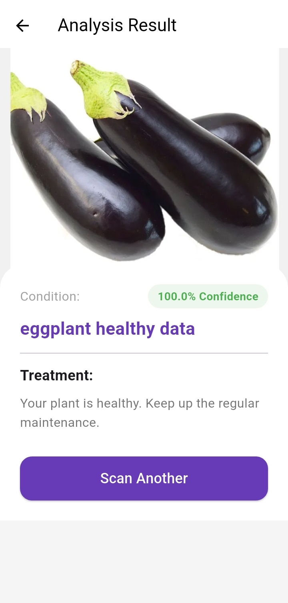

# 🍆 Eggplant Disease Detector using Deep Learning & Flutter

<p align="center">
  
  
  
  
  
</p>

---

# 📌 Project Overview

The **Eggplant Disease Detector** is an AI-powered mobile application developed to identify and classify common eggplant diseases using **Deep Learning**, **Computer Vision**, and **Mobile AI Deployment** technologies.

This project combines:

* 📱 A modern Flutter mobile application
* 🧠 CNN-based Deep Learning model
* ⚡ TensorFlow Lite (TFLite) on-device inference
* 🌿 Smart agriculture disease diagnosis

The application allows users to capture or upload eggplant leaf images and instantly receive disease predictions directly on their mobile device.

This project demonstrates practical implementation of Artificial Intelligence in:

* Smart Agriculture
* Precision Farming
* Mobile AI Systems
* Real-Time Disease Classification

---

# 🎯 Objectives

* Detect eggplant diseases automatically from leaf images
* Assist farmers with early disease identification
* Build an offline AI-powered mobile application
* Apply Deep Learning to real-world agricultural problems
* Develop a scalable and portable smart farming solution

---

# ✨ Key Features

## 📷 AI-Based Disease Detection

The application detects:

* 🟢 Healthy Leaves
* 🔴 Cercospora Melongenae
* 🟣 Leucinodes Orbonalis
* 🟠 Phomopsis Blight

---

## 📱 Flutter Mobile Application

* Cross-platform support
* Clean and modern user interface
* Android & iOS compatibility

---

## ⚡ Real-Time Prediction

* Instant image classification
* Fast on-device inference
* Smooth mobile experience

---

## 🌐 Offline Functionality

* Works without internet connection
* TensorFlow Lite model deployed directly on device

---

## 🧠 Deep Learning Powered

* CNN-based image classification model
* Trained using TensorFlow & Keras
* Optimized for mobile deployment

---

# 🛠️ Technologies Used

| Technology      | Purpose                        |
| --------------- | ------------------------------ |
| Flutter         | Mobile Application Development |
| Dart            | Flutter Programming            |
| Python          | Model Development              |
| TensorFlow      | Deep Learning                  |
| Keras           | CNN Model Training             |
| TensorFlow Lite | Mobile AI Inference            |
| NumPy           | Numerical Processing           |
| OpenCV          | Image Processing               |
| Git & GitHub    | Version Control                |

---

# 📂 Project Structure

```bash
Eggplant-Disease-Detector/
│
├── lib/                         # Flutter Application Source Code
├── assets/                      # App Assets & Labels
├── android/                     # Android Configuration
├── ios/                         # iOS Configuration
├── linux/                       # Linux Support
│
├── model_training/              # CNN Model Training Notebooks
│
├── App_Summary/
│   ├── App Interface.jpeg
│   ├── Disease Ditector.jpeg
│   ├── Result.jpeg
│   └── Demo.mp4
│
├── README.md
└── pubspec.yaml
```

---

# 📸 Application Preview

## 🖥️ Dashboard Interface

<p align="center">
  
</p>

---

## 🔍 Disease Detection

<p align="center">
  
</p>

---

## 📊 Prediction Result

<p align="center">
  
</p>

---

# 🎥 Project Demonstration

# 🎥 Project Demonstration

## ▶️ Demo Video

<p align="center">
  <a href="App_Summary/Demo.mp4">
    
  </a>
</p>

<p align="center">
  🔗 Click the image above to watch the demo video
</p>

---

# 📊 Dataset Information

The model was trained using publicly available agricultural datasets hosted on Kaggle.

## 🔗 Dataset Links

### 🟢 Healthy Leaves

[https://www.kaggle.com/datasets/mdnasimhawlader/healthy-datasheet](https://www.kaggle.com/datasets/mdnasimhawlader/healthy-datasheet)

### 🔴 Cercospora Melongenae

[https://www.kaggle.com/datasets/mdnasimhawlader/cercospora-melongenae-disease-of-eggplant](https://www.kaggle.com/datasets/mdnasimhawlader/cercospora-melongenae-disease-of-eggplant)

### 🟣 Leucinodes Orbonalis

[https://www.kaggle.com/datasets/mdnasimhawlader/leucinodes-orbonalis-disease-of-eggplant](https://www.kaggle.com/datasets/mdnasimhawlader/leucinodes-orbonalis-disease-of-eggplant)

### 🟠 Phomopsis Blight

[https://www.kaggle.com/datasets/mdnasimhawlader/phomopsis-blight-of-eggplant](https://www.kaggle.com/datasets/mdnasimhawlader/phomopsis-blight-of-eggplant)

---

# 🧪 Model Training Workflow

```text
Dataset Collection
        ↓
Image Preprocessing
        ↓
Data Augmentation
        ↓
CNN Model Training
        ↓
Model Evaluation
        ↓
TensorFlow Lite Conversion
        ↓
Flutter App Integration
```

---

# 🚀 Installation Guide

## 1️⃣ Clone Repository

```bash
git clone https://github.com/nasim-dev0459/Eggplant-Disease-Detector.git
```

---

## 2️⃣ Move Into Project Directory

```bash
cd Eggplant-Disease-Detector
```

---

## 3️⃣ Install Flutter Dependencies

```bash
flutter pub get
```

---

## 4️⃣ Run Application

```bash
flutter run
```

---

# 📈 Future Improvements

* 🌐 Cloud Database Integration
* 🤖 Advanced Transfer Learning Models
* 📊 Disease Analytics Dashboard
* 🌍 Multi-Crop Disease Detection
* 🔔 Farmer Notification System
* 📱 Play Store Deployment

---

# 🎓 Academic & Research Value

This project demonstrates practical experience in:

* Deep Learning
* Mobile AI Deployment
* TensorFlow Lite Optimization
* Flutter Development
* Computer Vision
* Smart Agriculture Systems

This project is highly suitable for:

* Internship Applications
* Scholarship Applications
* AI/ML Portfolio Showcase
* Final Year Projects
* Research Demonstrations

---

# 💡 Learning Outcomes

Through this project, I gained experience in:

* CNN Architecture Design
* TensorFlow & Keras
* Mobile AI Integration
* Flutter App Development
* Image Classification Systems
* Real-Time AI Inference

---

# 🤝 Contributing

Contributions are welcome.

If you would like to improve this project:

1. Fork the repository
2. Create a new branch
3. Commit your changes
4. Submit a Pull Request

---

# 📜 License

This project is developed for:

* Educational Purposes
* Research
* Portfolio Showcase

---

# 👨‍💻 Developer

## Md Nasim Hawlader

B.Sc. in Computer Engineering

### Interests

* Artificial Intelligence
* Deep Learning
* Mobile App Development
* Computer Vision
* Smart Agriculture
* Machine Learning

---

# ⭐ Support

If you found this project useful, please give it a ⭐ on GitHub.
Your support motivates future AI and research projects 🚀
